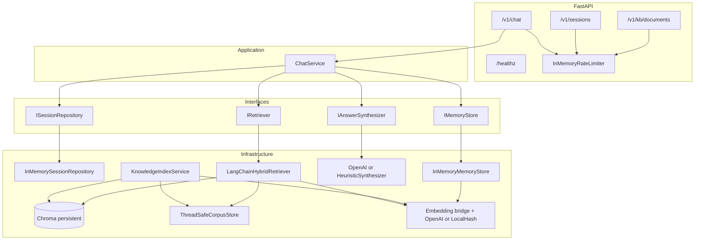

# Copilot IITB — Modular RAG API

Python service that combines **LangChain**, **Chroma** (persistent vector store), **hybrid retrieval** (dense + BM25 with reciprocal rank fusion), **layered session memory**, **source citations**, and a **FastAPI** surface. Core behavior is expressed behind small interfaces so you can swap storage, models, or retrieval without rewriting orchestration.

**RAG implementation**: Indexing, chunking, and retrieval use **LangChain** (`langchain-chroma`, `langchain-text-splitters`, `langchain-community`, `langchain-core`, plus `langchain-openai` when configured). This codebase does **not** use LlamaIndex; the integration lives under `copilot_iitb/infrastructure/langchain/`. Python dependencies are listed in `requirements.txt`.

---

## Table of contents

1. [Features](#features)
2. [Quick start](#quick-start)
3. [Configuration and environment variables](#configuration-and-environment-variables)
4. [Architecture](#architecture)
5. [Internal components](#internal-components)
6. [Request lifecycle (chat)](#request-lifecycle-chat)
7. [Knowledge base indexing](#knowledge-base-indexing)
8. [HTTP API reference](#http-api-reference)
9. [Data models (JSON shapes)](#data-models-json-shapes)
10. [Operational notes](#operational-notes)
11. [Extending the system](#extending-the-system)

---

## Features

- **Sessions**: Server-issued `session_id`; in-memory repository (replaceable with Redis/DB).
- **Memory**: Short-term transcript, episodic turn summaries, long-term hints keyed by optional `user_id` (embedding similarity over stored items).
- **RAG**: Chunked indexing with metadata; hybrid retrieval; optional reranker hook (`IReranker`).
- **Grounding**: Evidence blocks passed to the LLM with JSON output; retrieval similarity gate before LLM when vector scores exist.
- **Safety / hygiene**: Basic input sanitization; system prompt instructs the model to treat evidence as untrusted data (prompt-injection awareness, not a full defense).
- **Concurrency**: Async API; blocking LangChain/Chroma work runs in thread pool where appropriate; async locks on memory and session stores; BM25 index rebuilt only when the corpus version changes.

---

## Quick start

### Prerequisites

- Python 3.10+ recommended
- Virtual environment (project includes `.venv` if you already created one)

### Install

```bash
python -m venv .venv
.venv\Scripts\activate
pip install -r requirements.txt
```

Create or edit `.env` in the project root (see [Configuration](#configuration-and-environment-variables)). The app loads it via `pydantic-settings` when the working directory is the project root.

### Run the API

```bash
python -m uvicorn copilot_iitb.api.main:app --host 0.0.0.0 --port 8000
```

Interactive OpenAPI docs: `http://localhost:8000/docs`.

---

## Configuration and environment variables

Settings are defined in `copilot_iitb/config/settings.py` and loaded from **environment variables** and optionally from a **`.env`** file in the current working directory (typically the project root).

`pydantic-settings` maps fields to environment variables using **upper snake case** (same as the Python field names, uppercased).

| Environment variable | Type | Default | Description |
|----------------------|------|---------|-------------|
| `OPENAI_API_KEY` | string (optional) | `None` | If set, OpenAI is used for embeddings and chat completion. If unset, the app uses **local hash embeddings** and a **heuristic offline synthesizer** (no live LLM). |
| `OPENAI_MODEL` | string | `gpt-4o-mini` | Chat model for `OpenAIStructuredSynthesizer`. |
| `OPENAI_EMBED_MODEL` | string | `text-embedding-3-small` | Embedding model when `OPENAI_API_KEY` is set. |
| `CHROMA_MODE` | `local` or `cloud` | `local` | `local`: embedded Chroma on disk at `CHROMA_PERSIST_DIR`. `cloud`: [Chroma Cloud](https://www.trychroma.com/) (set `CHROMA_CLOUD_API_KEY` and usually `CHROMA_TENANT` / `CHROMA_DATABASE` from the dashboard). |
| `CHROMA_PERSIST_DIR` | path | `./data/chroma` | **Local only**: directory for Chroma persistent storage. Created on startup if missing. |
| `CHROMA_COLLECTION` | string | `kb_documents` | Chroma collection name for the knowledge index. |
| `CHROMA_CLOUD_API_KEY` | string (optional) | `None` | **Required when** `CHROMA_MODE=cloud`. API key from Chroma Cloud. |
| `CHROMA_TENANT` | string (optional) | `None` | Chroma Cloud tenant id (if your key is not single-database scoped). |
| `CHROMA_DATABASE` | string (optional) | `None` | Chroma Cloud database name. |
| `RETRIEVAL_TOP_K` | int (1–50) | `8` | Vector retriever: how many chunks to fetch before fusion/filtering. |
| `FUSION_TOP_K` | int (1–20) | `5` | Max chunks returned after hybrid fusion (RRF). |
| `BM25_TOP_K` | int (1–50) | `8` | BM25 leg: top results before fusion. |
| `MIN_EVIDENCE_SIMILARITY` | float (0–1) | `0.22` | If the **best** chunk has a `vector_similarity` below this, the service returns an explicit low-confidence answer **without** calling the LLM (when vector scores are present on retrieved chunks). |
| `SHORT_TERM_MAX_MESSAGES` | int (2–200) | `20` | Max messages retained per session in short-term memory (FIFO via bounded deque). |
| `LLM_CONTEXT_RECENT_TURNS` | int (0–50) | `6` | How many recent `ChatMessage` records shape the `recent_dialogue` string passed to the synthesizer (not used as the retrieval query). |
| `REQUEST_TIMEOUT_SECONDS` | float (5–600) | `120` | Timeout for OpenAI chat completion requests. |
| `RATE_LIMIT_PER_MINUTE` | int (1–10000) | `120` | Per-client approximate cap on requests per rolling 60s window (in-process; see `api/rate_limit.py`). |

**Client key for rate limiting**: `X-Forwarded-For` first hop if present, else `request.client.host`, else `anonymous`.

---

## Architecture

High-level dependency flow (composition root: `copilot_iitb/api/main.py` lifespan):



---

## Internal components

### Package layout

| Path | Responsibility |
|------|------------------|
| `copilot_iitb/config/settings.py` | Central `Settings` object; env / `.env` loading. |
| `copilot_iitb/domain/models.py` | Pydantic models shared by API and services (`ChatRequest`, `RAGAnswer`, etc.). |
| `copilot_iitb/core/interfaces/` | Abstract contracts: embeddings, retrieval, reranking, memory, sessions, knowledge index, answer synthesis. |
| `copilot_iitb/application/chat_service.py` | Orchestrates sanitize → session → memory → retrieve → gate → synthesize → persist. |
| `copilot_iitb/api/main.py` | FastAPI app, lifespan wiring, `AppContainer` construction. |
| `copilot_iitb/api/routes/` | Route modules: `health`, `sessions`, `chat`, `kb`. |
| `copilot_iitb/api/rate_limit.py` | Simple in-memory rate limiter (per deployment instance). |
| `copilot_iitb/infrastructure/langchain/` | Chroma vector store, hybrid retriever, corpus mirror + bootstrap, embeddings. |
| `copilot_iitb/infrastructure/llm/structured_synthesizer.py` | OpenAI JSON-mode synthesizer vs offline heuristic. |
| `copilot_iitb/infrastructure/memory/` | `InMemoryMemoryStore` (async locks per session / user). |
| `copilot_iitb/infrastructure/session/` | `InMemorySessionRepository`. |
| `copilot_iitb/infrastructure/security/input_guard.py` | Strip control chars, cap length. |

### Embeddings

- **With `OPENAI_API_KEY`**: `OpenAIEmbeddings` from `langchain-openai` for vectors; dimension is detected at runtime (no hard-coded vector size in application logic).
- **Without key**: `LocalHashEmbedding` — deterministic unit vectors from hashed text; `dimensions` default 256 (configurable in code if you extend settings).

**Important**: Changing embedding provider or model after data exists in Chroma generally requires **re-indexing** or a **new collection**, because stored vectors must match the query embedding space and dimension.

### Retrieval (`LangChainHybridRetriever`)

1. **Vector leg**: `Chroma.similarity_search_with_score` (LangChain’s Chroma wrapper) over the persistent collection; Chroma cosine **distance** is mapped to a `[0, 1]` **similarity** for the evidence gate.
2. **Lexical leg** (if the in-memory corpus has documents): `BM25Retriever` from `langchain_community` built from `ThreadSafeCorpusStore`. The BM25 object is **cached** and invalidated when the corpus store **version** increments (`aextend` / `areset`).
3. **Fusion**: Reciprocal Rank Fusion (RRF) merges the two ranked lists; output size capped by `FUSION_TOP_K`.
4. **Metadata filters**: Post-filter on chunk metadata for both legs when `metadata_filters` is supplied on chat (AND semantics: every key in the filter dict must match the chunk metadata).
5. **Vector similarity on chunks**: Each `RetrievedChunk` may include `metadata["vector_similarity"]` from the vector leg for the same chunk id (`metadata["id"]`), used by `ChatService` for the evidence gate.

### Reranking

`IReranker` is implemented by `NoOpReranker` by default. Implement a new class (for example cross-encoder scoring) and inject it in `main.py` where `LangChainHybridRetriever` is constructed.

---

## Request lifecycle (chat)

1. **Rate limit** check (`client_key` from headers / client IP).
2. **Input guard**: trim, remove ASCII control characters, max length 16_000.
3. **Session**:
   - If `session_id` is sent: must exist or `400` with `Unknown session_id=...`.
   - If omitted: a new session is created; optional `user_id` is stored on the session record when provided at creation time (session route) or can be passed per chat request for long-term memory (see API below).
4. **Short-term memory**: append user message.
5. **Dialogue for LLM only**: load up to `SHORT_TERM_MAX_MESSAGES`, take last `LLM_CONTEXT_RECENT_TURNS` messages, format as `recent_dialogue` (does **not** drive retrieval verbatim).
6. **Retrieval query**: current user text + optional short hint from the **last** episodic summary (max 400 chars) — avoids dumping full history into retrieval.
7. **Long-term hints**: if `user_id` is set on the chat request, embed the query and cosine-rank stored long-term items for that user; inject as `memory_hints` into the synthesizer.
8. **Retrieve** chunks with optional `metadata_filters`.
9. **Evidence gate**: if any `vector_similarity` exists and `max(vector_similarity) < MIN_EVIDENCE_SIMILARITY`, return a fixed cautious answer, citations from chunks, `insufficient_evidence=true`, **no LLM call**.
10. **Synthesize** (if gate passes): evidence blocks labeled `E1`, `E2`, …; OpenAI returns JSON parsed into `RAGAnswer`; if citations empty, filled from chunks; confidence floored by best vector similarity when applicable.
11. **Persist**: assistant message to short-term; episodic turn summary appended.

---

## Knowledge base indexing

`POST /v1/kb/documents` accepts `IndexDocumentRequest`. The service:

1. Normalizes **metadata** (merges your `metadata` dict with defaults).
2. Prepends a small **header** to the body text (`title`, `updated_at`, `owner`) to improve chunk context.
3. Splits with `RecursiveCharacterTextSplitter(chunk_size=512, chunk_overlap=64)` from `langchain-text-splitters`.
4. Writes chunks into **Chroma** via `Chroma.add_documents` (with explicit chunk ids in metadata).
5. Appends the full logical `Document` to **`ThreadSafeCorpusStore`** for BM25 (mirror of indexed content; on process start, `bootstrap_corpus_from_chroma` reloads chunk texts from Chroma into the corpus store so BM25 works after restart).

### Chunk metadata keys (stored on each chunk)

| Key | Source |
|-----|--------|
| `document_id` | Request |
| `title` | Request |
| `source` | Request `metadata.source` or `user_upload` |
| `updated_at` | Request `metadata.updated_at` or UTC ISO timestamp |
| `owner` | Request `metadata.owner` or `unknown` |
| `language` | Request `metadata.language` or `und` |
| `access_scope` | Request `metadata.access_scope` or `public` |
| `product_area` | Request `metadata.product_area` or `general` |
| `version` | Request `metadata.version` or `1` |

Use these keys in `metadata_filters` on chat to restrict retrieval (post-filter).

---

## HTTP API reference

Base URL: `http://localhost:8000` (default uvicorn).

All listed routes except `GET /healthz` apply the **rate limiter** once per request.

### `GET /healthz`

**Purpose**: Liveness probe.

**Response**: `200` JSON `{"status":"ok"}`.

---

### `POST /v1/sessions`

**Purpose**: Create a new chat session.

**Request body** (JSON, optional):

| Field | Type | Required | Description |
|-------|------|----------|-------------|
| `user_id` | string or null | No | Optional stable user identifier (stored on the session record). |

**Response** `200`:

```json
{ "session_id": "<uuid>" }
```

**Example**:

```bash
curl -s -X POST http://localhost:8000/v1/sessions ^
  -H "Content-Type: application/json" ^
  -d "{\"user_id\": \"user-123\"}"
```

---

### `POST /v1/chat`

**Purpose**: Send a user message; receive a grounded `RAGAnswer` and debug retrieval fields.

**Request body** (`ChatRequest`):

| Field | Type | Required | Description |
|-------|------|----------|-------------|
| `session_id` | string or null | No | Existing session. If invalid, `400`. If null, a **new** session is created. |
| `user_id` | string or null | No | If set, enables **long-term memory hints** for this request (cosine match over stored long-term items). |
| `message` | string | Yes | User text, 1–16000 chars after sanitization. |
| `metadata_filters` | object or null | No | Flat dict; every key must match chunk metadata exactly (AND). |

**Response** `200` (`ChatResponse`):

| Field | Description |
|-------|-------------|
| `session_id` | Session used for this turn. |
| `result` | `RAGAnswer` (see below). |
| `retrieval_debug` | `retrieval_query`, `num_chunks`, `best_vector_similarity` (may be null). |

**Errors**:

| Status | When |
|--------|------|
| `400` | Unknown `session_id`, or validation error on body. |
| `429` | Rate limit exceeded. |

**Example** (new session + index filter):

```bash
curl -s -X POST http://localhost:8000/v1/chat ^
  -H "Content-Type: application/json" ^
  -d "{\"message\": \"What is the refund policy?\", \"metadata_filters\": {\"product_area\": \"billing\"}}"
```

**Example** (continuing a session):

```bash
curl -s -X POST http://localhost:8000/v1/chat ^
  -H "Content-Type: application/json" ^
  -d "{\"session_id\": \"<uuid>\", \"message\": \"Summarize section 2\", \"user_id\": \"user-123\"}"
```

---

### `POST /v1/kb/documents`

**Purpose**: Ingest a logical document into Chroma and the BM25 corpus mirror.

**Request body** (`IndexDocumentRequest`):

| Field | Type | Required | Description |
|-------|------|----------|-------------|
| `document_id` | string | Yes | Stable id for the source document. |
| `title` | string | Yes | Shown in metadata and prepended to chunk text. |
| `text` | string | Yes | Main body to chunk and embed. |
| `metadata` | object | No | Extra fields merged with defaults (see table above). |

**Response** `200`:

```json
{ "chunks": <number_of_chunks_written> }
```

**Example**:

```bash
curl -s -X POST http://localhost:8000/v1/kb/documents ^
  -H "Content-Type: application/json" ^
  -d "{\"document_id\": \"pol-001\", \"title\": \"Refund Policy\", \"text\": \"...\", \"metadata\": {\"owner\": \"legal\", \"product_area\": \"billing\", \"access_scope\": \"internal\"}}"
```

---

## Data models (JSON shapes)

### `RAGAnswer`

```json
{
  "answer": "string",
  "citations": [
    {
      "chunk_id": "string",
      "document_id": "string or null",
      "title": "string or null",
      "snippet": "string",
      "score": 0.0
    }
  ],
  "confidence": 0.0,
  "insufficient_evidence": false,
  "follow_up_question": "string or null"
}
```

### `ChatResponse`

```json
{
  "session_id": "string",
  "result": { },
  "retrieval_debug": {
    "retrieval_query": "string",
    "num_chunks": 0,
    "best_vector_similarity": null
  }
}
```

OpenAPI and validation details are also available at `/docs` and `/openapi.json`.

---

## Operational notes

1. **Secrets**: Never commit real `.env` files; use your platform’s secret store in production.
2. **Multi-instance**: In-memory sessions, memory, and rate limits are **not** shared across processes. Use external stores for horizontal scaling.
3. **BM25 vs Chroma**: After restart, BM25 operates over texts **reloaded from Chroma** (`bootstrap_corpus_from_chroma`). New indexing extends both Chroma and the in-memory corpus during the same process lifetime.
4. **Tuning**: Raise `MIN_EVIDENCE_SIMILARITY` for stricter “I don’t know” behavior; adjust `RETRIEVAL_TOP_K` / `FUSION_TOP_K` together — larger `k` is not always better for LLM context quality.
5. **SSL / pip**: If corporate TLS inspection breaks `pip install`, fix certificates or use your IT-approved index mirror.

---

## Extending the system

| Goal | Suggested change |
|------|------------------|
| Persistent sessions | Implement `ISessionRepository` with Redis/Postgres; wire in `main.py`. |
| Persistent memory | Implement `IMemoryStore` with TTL and encryption for PII. |
| Stronger reranking | New `IReranker` implementation; inject into `LangChainHybridRetriever`. |
| Different LLM vendor | New `IAnswerSynthesizer` adapter; keep JSON shape compatible with `RAGAnswer`. |
| Different vector DB | New LangChain vector store + construction in lifespan (keep `IKnowledgeIndex` implementation aligned). |
| AuthN/Z | Add FastAPI dependencies (API keys, OAuth2) in front of routers; map to `metadata_filters` / tenant ids. |

---

## License

Add your organization’s license here if applicable.
